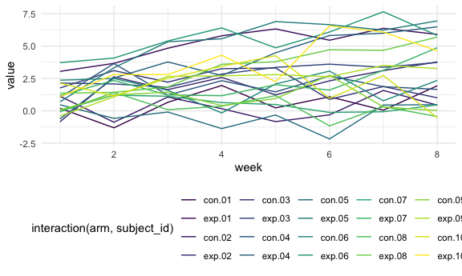

Homework 5
================
Renee Wang UNI:hw2851
11/20/2021

## Problem 1

Read in the data.

``` r
homicide_df = 
  read_csv("./data/homicide-data.csv", na = c("","Unknown")) %>%
  mutate(city_state = str_c(city, state),
         resolution = case_when(
              disposition == "Closed without arrest" ~ "unsolved",
              disposition == "Open/No arrest"        ~ "unsolved",
              disposition == "Closed by arrest"      ~ "solved")) %>%
  relocate(city_state) %>%
  filter(city_state != "Tulsa_AL")
```

    ## Rows: 52179 Columns: 12

    ## ── Column specification ────────────────────────────────────────────────────────
    ## Delimiter: ","
    ## chr (8): uid, victim_last, victim_first, victim_race, victim_sex, city, stat...
    ## dbl (4): reported_date, victim_age, lat, lon

    ## 
    ## ℹ Use `spec()` to retrieve the full column specification for this data.
    ## ℹ Specify the column types or set `show_col_types = FALSE` to quiet this message.

``` r
baltimore_df =
  homicide_df %>%
  filter(city_state == "BaltimoreMD")

baltimore_summary =
  baltimore_df %>%
  summarize(
    unsolved = sum(resolution == "unsolved"),
    n = n()
  )

baltimore_test =
  prop.test(
    x = baltimore_summary %>% pull(unsolved),
    n = baltimore_summary %>% pull(n))

baltimore_test %>%
  broom::tidy()  
```

    ## # A tibble: 1 × 8
    ##   estimate statistic  p.value parameter conf.low conf.high method    alternative
    ##      <dbl>     <dbl>    <dbl>     <int>    <dbl>     <dbl> <chr>     <chr>      
    ## 1    0.646      239. 6.46e-54         1    0.628     0.663 1-sample… two.sided

# Problem2

``` r
# read all data files
prob_2_data =
 tibble(
  filename = list.files("./data/zip_data/"))

# build a function that read file content
readcsv = function(csv, path="./data/zip_data"){
 paste(path,csv,sep="/")  %>%
   read.csv()}

prob_2_data =
  prob_2_data %>%
  mutate(raw_results = map(prob_2_data$filename, readcsv)) %>%
  # unnest for easier plot
  unnest(raw_results) %>%
  # remove .csv part
  mutate(filename_wo_extension = map_chr(.x = filename, ~ unlist(str_split(.x, "\\.") )[[1]] ) ) %>%
  # split by '_' to extract arm and subject id
  mutate(arm = map_chr(.x = filename_wo_extension, ~ unlist(str_split(.x, "_") )[[1]] )) %>%
  mutate(subject_id = map_chr(.x = filename_wo_extension, ~ unlist(str_split(.x, "_") )[[2]] ))

# create a pivoted version to make plotting easier
prob_2_data_pivoted =
  prob_2_data %>%
  pivot_longer(week_1:week_8,
               names_to = "week",
               names_prefix = "week_",
               values_to = "value")
prob_2_plot =
  prob_2_data_pivoted %>%
  select(week, value, filename_wo_extension) %>%
  group_by(filename_wo_extension) %>%
  ggplot(aes(x = week, y = value, color=filename_wo_extension)) +
    geom_line()

prob_2_plot
```

    ## geom_path: Each group consists of only one observation. Do you need to adjust
    ## the group aesthetic?


